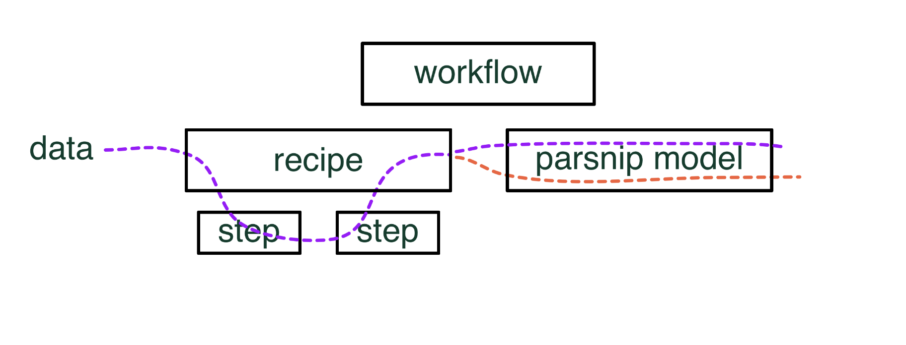

```{r, include = FALSE}
knitr::opts_chunk$set(
  collapse = TRUE,
  comment = "#>"
)
```

## Abstract

Many statistical and machine learning methods work with and are optimized to work with sparse data. Working in a tidy way (using tibbles) excludes you from certain methods and workflows by not being able to take advantage of sparse formats. The purpose of this tidyup is to propose adding sparse column support for tibbles.

## What is sparse data?

```{r}
library(sparsevctrs)
vec_len <- 100
sparse <- new_sparse_vector(
  values = c(10, 20),
  positions = c(1, 2),
  length = vec_len
)
dense <- c(c(10, 20), rep(1, vec_len - 2))

lobstr::obj_size(sparse)
lobstr::obj_size(dense)
```

## The problem

One of the great features of using tibbles compared to traditional data types such as matrices and sparse matrices is that you are not constrained to use just 1 type. Effortlessly storing numerics, factors, and dates makes data wrangling and preprocessing much cleaner.

In {recipes}, tibbles are used internally to handle the data. Each step receives a tibble and some instructions and returns a (possibly) modified tibble. {recipes} also allow one to return the final result in the following desired formats "tibble", "matrix", "data.frame", or "dgCMatrix", but the effects of using a `dgcMatrix` is negligent because you are forced to have carried around the data in the non-sparse format first. 

This could be excluding you from working data that would fit in memory sparsely but would be too big to store non-sparsely. This is a blocker for using most of {tidymodels} if you have large sparse data and excludes certain modeling tasks from being feasible within the {tidymodels} framework.



One of the cases where sparse data is used in modeling comes when extracting count features from text data. Below is a small example using the `friends` data set which includes almost 70.000 lines of dialog. Creating count features of the different words results in a 4.69 GB tibble.  

``` r
library(tidymodels)
library(textrecipes)
library(friends)

preped_rec <- recipe(season ~ text, data = friends) %>%
  step_tokenize(text) %>%
  step_tf(text) %>%
  prep()
#> Warning in asMethod(object): sparse->dense coercion: allocating vector of size
#> 8.7 GiB

term_freq <- bake(preped_rec, new_data = NULL)

dim(term_freq)
#> [1] 67373 17378

lobstr::obj_size(term_freq)
#> 4.69 GB
```

```r
glimpse(term_freq[7070:7080])
#> Rows: 67,373
#> Columns: 11
#> $ tf_text_hazelnut  <int> 0, 0, 0, 0, 0, 0, 0, 0, 0, 0, 0, 0, 0, 0, 0, 0, 0, 0…
#> $ tf_text_hbo       <int> 0, 0, 0, 0, 0, 0, 0, 0, 0, 0, 0, 0, 0, 0, 0, 0, 0, 0…
#> $ tf_text_he        <int> 0, 0, 1, 1, 0, 0, 0, 0, 0, 0, 0, 0, 0, 0, 0, 0, 0, 0…
#> $ `tf_text_he'd`    <int> 0, 0, 0, 0, 0, 0, 0, 0, 0, 0, 0, 0, 0, 0, 0, 0, 0, 0…
#> $ `tf_text_he'll`   <int> 0, 0, 0, 0, 0, 0, 0, 0, 0, 0, 0, 0, 0, 0, 0, 0, 0, 0…
#> $ `tf_text_he's`    <int> 1, 0, 0, 0, 0, 0, 0, 0, 0, 0, 0, 0, 0, 0, 0, 0, 0, 0…
#> $ tf_text_head      <int> 0, 0, 0, 0, 0, 0, 0, 0, 0, 0, 0, 0, 0, 0, 0, 0, 0, 0…
#> $ tf_text_headache  <int> 0, 0, 0, 0, 0, 0, 0, 0, 0, 0, 0, 0, 0, 0, 0, 0, 0, 0…
#> $ tf_text_headaches <int> 0, 0, 0, 0, 0, 0, 0, 0, 0, 0, 0, 0, 0, 0, 0, 0, 0, 0…
#> $ tf_text_headboard <int> 0, 0, 0, 0, 0, 0, 0, 0, 0, 0, 0, 0, 0, 0, 0, 0, 0, 0…
#> $ tf_text_headdddd  <int> 0, 0, 0, 0, 0, 0, 0, 0, 0, 0, 0, 0, 0, 0, 0, 0, 0, 0…
```

Other counts such as bi-grams would result in 164,734 columns, and including 1, 2, and 3-grams include 552,852 columns. 

Having all these columns represented non-sparsely would be a non-starter for many people. On the other hand, the sparse format would be many times smaller. Here shown using {quanteda}.

```r
library(quanteda)
library(friends)

sparse_mat <- tokens(friends$text) %>%
  dfm()

dim(sparse_mat)
#> [1] 67373 19568

lobstr::obj_size(sparse_mat)
#> 16.55 MB
```

## Possible Solution

{sparsevctrs}

- Creating an {vctrs} vector that works mimics `Matrix::sparseVector()`
- Creating the appropriate `as.*` to efficiently move from tibbles to Matrix sparse formats

```{r}
library(sparsevctrs)
vec <- new_sparse_vector(
  values = c(2, 1, 3),
  positions = c(2, 5, 9),
  length = 10
)

vec
```

Internally only sufficient data is stored

```{r}
str(vec)
```

My "trick" here is to populate the data field with an ALTREP sequence

```{r}
vctrs::vec_data(vec)
new_sparse_vector
```

# What I want the vector to be able to do

- something that passes `vec_is()` and thus able to be passed to a `tibble()`
- behaves like other vectors w.r.t. subsetting, etc etc
- has support for arithmetic

The above would represent the 80% use-case.

Would be awesome, but not a high priority

- Math operations

This would bring us up to 95% use-case:

```{r}
library(dplyr)

df <- tibble(
  x = rep(1:2, length.out = 10),
  y = new_sparse_vector(values = 1, positions = 7, length = 10),
  z = new_sparse_vector(values = 2, positions = 6, length = 10)
)

df

df |>
  filter(x == 1) |>
  summarise(sum(y + z))
```

## What I don't want

- A replacement for {Matrix} package.

## What needs to happen

2 main areas:

- vctrs / ALTREP infrastructure (I need help/assistance/teamwork)

This package works enough to showcase what I want, but missing a lot of things. This is likely to be because I don't understand {vctrs} enough, or because it can't be done in the current state of {vctrs}. 

After chatting with some people, an ALTREP thing might also be the solution.

Regardless of the choice, I would need help with this part.

- algorithms to perform the tasks

Depending on the above choice these would be implemented in R or C. Many are fairly simple as the data structure itself is simple

```{r}
sparse_multiplication <- function(x, y) {
  x_pos <- positions(x)
  x_val <- values(x)
  y_pos <- positions(y)
  y_val <- values(y)
  
  out_pos <- intersect(x_pos, y_pos)
  out_val <- x_val[match(out_pos, x_pos)] * y_val[match(out_pos, y_pos)]
  
  new_sparse_vector(
    values = out_val,
    positions = out_pos,
    length = length(x)
  )
}
```

And I should be able to handle these.

## Tidymodels Benchmarking

Without sparsevctrs
https://gist.github.com/EmilHvitfeldt/029c8c0e6d5cc6f2b5ef75fb3ac321ea

With sparsevctrs
https://gist.github.com/EmilHvitfeldt/a3da6a9a870e6ddbe7d371df1d5abfd2

## Demand in the wild

This request has been brought up before in this related issues:
https://github.com/tidyverse/tibble/issues/196
https://github.com/tidyverse/tibble/issues/339
